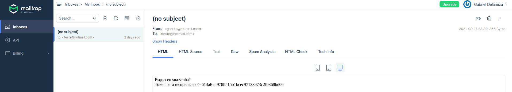

Portal de cadastro de usuários.

- MongoDB noSQL database.
- Bcryptjs utilizado para hash de senha.
- Nodemailer utilizado para teste de emails.
- Mailtrap em conexão com Nodemailer para envio de token no email.
- Autenticação com JWT(JasonWebToken).

## RECOVER PASSWORD

Backend desenvolvido até o momento, para o acesso final do usuário, será implementado o front utilizando VueJs.
