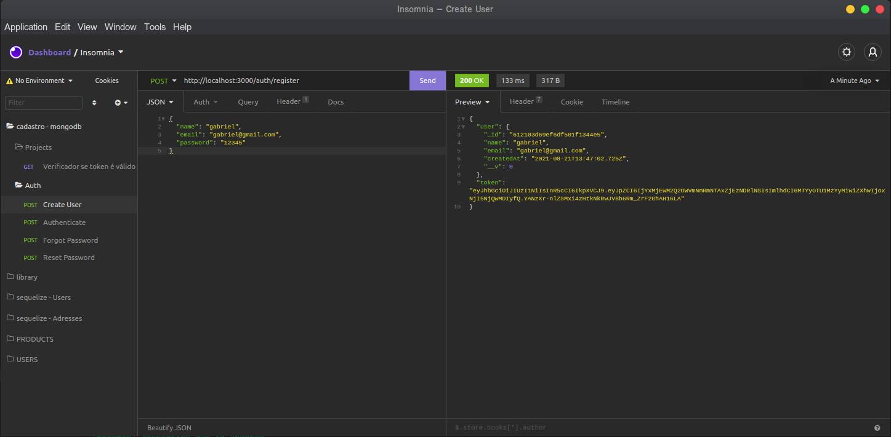
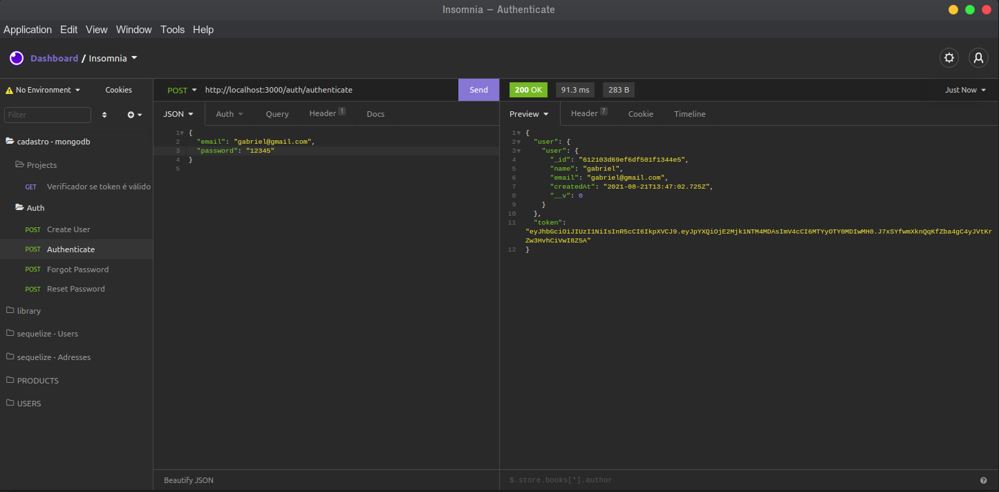
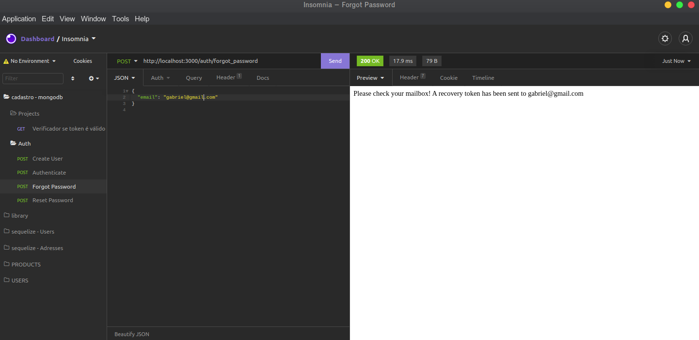
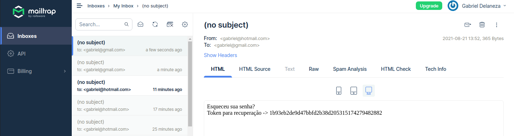
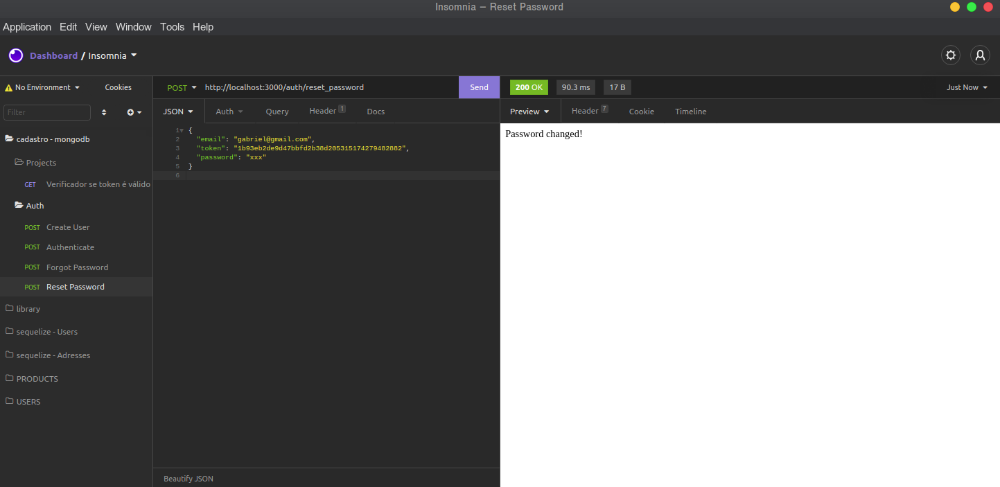

## AUTHGATOR

Portal de cadastro de usuários.

- MongoDB noSQL database.
- Bcryptjs utilizado para hash de senha.
- Nodemailer em conexão com Mailtrap para envio de emails.
- Envio de token de recuperação de senha para o email.
- Autenticação com JWT(JasonWebToken).


## Create User



## Authenticate User



## Forgot Password



## Getting Recovering Token By Email



## Password Reset



# Setup

Requer uma versão do node instalado, preferencialmente node v12+

Instalar as dependencias, subir o ambiente e testar.

### Instalar dependências

```bash
$ npm install
```

### Subir o docker-compose com mongo

```bash
$ docker-compose up
```

#
Backend desenvolvido até o momento, posteriormente será implementado o front utilizando VueJs.
#